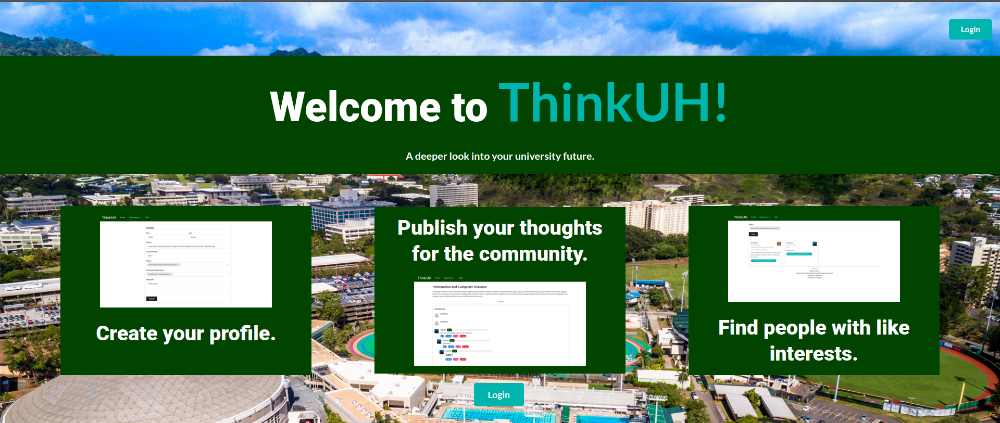
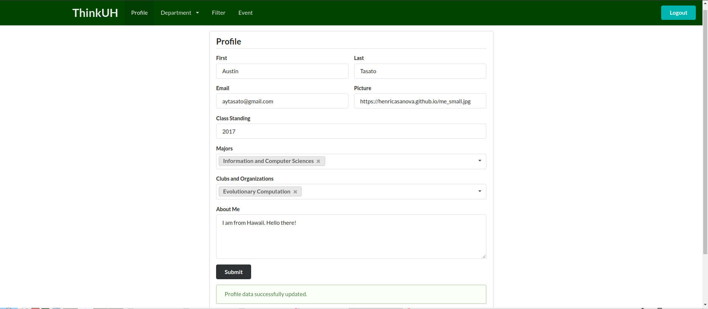
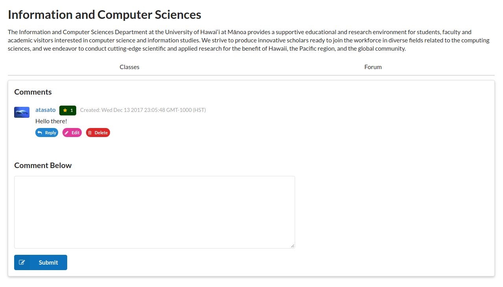
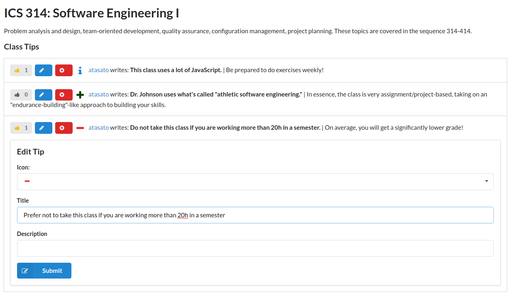
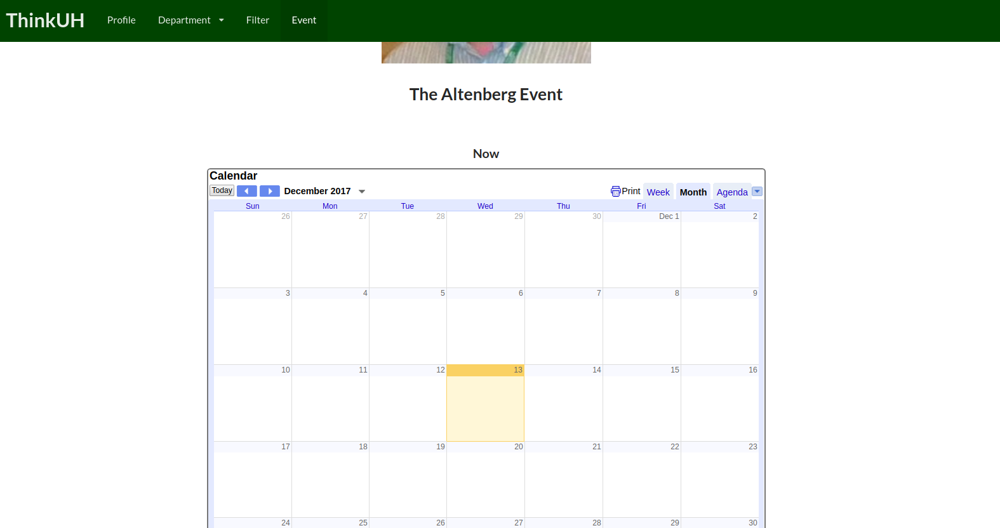

# Introducing: ThinkUH

#### "a guide to the University of Hawai'i at Manoa community"

## Overview

### The Problem

As a student on campus, wouldn't you like to know about the good and bad of each 
course? How about knowing what parts *really* gave people trouble? Or how about 
hearing voices from other students commenting on each course? Or how about 
hearing about the different clubs and events going on at campus?

### The Solution

[**ThinkUH**](https://thinkuh.meteorapp.com/) is a crowd-sourced information 
source for your academic courses and your community. Join and learn from fellow 
students about what your future is really like, and what is presently going on!

## User Guide

From the landing page, you can see a preview of what is on the site after you login using your UH ID to your personal account.

From there, you will be redirected to your profile page.  Here you can fill in some basic information about yourself so you can be more easily identified on your posts.  This includes your name, major, profile image of yourself, etc.

From the 'Departments' menu, you can navigate to the pages for individual majors, where you will be able to interact on the major's forum, or see a list of classes you will need to take in the future.

On the course page, you will see more detailed information for each course.  You can interact on the course's forum, or read through helpful tips for the class.  You can also give tips if you have previously taken the course.

The filter page lets you see the profiles of other people in your major, or of any major you should choose.  This way you can see who will be teaching what course, and their attributes and interests.

Events shows what events are comimg up in the community, allowing you to stay 
ontop of your school life.  There is also a calendar should anyone in the ICS 
community need to schedule important events.

## Community Feedback

To test out our project, we had five adults try out the program. Most of them 
agreed that the site was pretty simple to navigate using the tabs on the top 
menu bar.  It was good that after they logged in it would lead them directly to 
making their profile. They also said this would be very useful when learning 
about new classes and adding events to the calendar. To improve, one adult said 
we could add a page for contact info, or a way to email the administrators of 
this website if they ran into any issues or had any questions.

## Developer Guide

First, [install Meteor](https://www.meteor.com/install).

You will then need to download [the latest version of 
ThinkUH](https://github.com/thinkuh/thinkuh/tree/master), or fork the repository 
and clone it to your desktop via git.

That done, open the command line in the `app/` directory of the repository. Type 
the command `meteor npm install`.

To run the program, use the command `meteor npm run start`.

To reset the databases, use `meteor reset`.

The initial databases can be found under `app/private/database/`.

Pages and layouts are in `app/imports/ui/`.

Collections are at `app/imports/api/`.

If you add any new pages, import them at `app/client/main.js`.  If these pages need routing, add the route at `app/imports/startup/client/router.js`.

## Milestones

[Milestone 1](https://github.com/thinkuh/thinkuh/projects/1)

[Milestone 2](https://github.com/thinkuh/thinkuh/projects/2)
