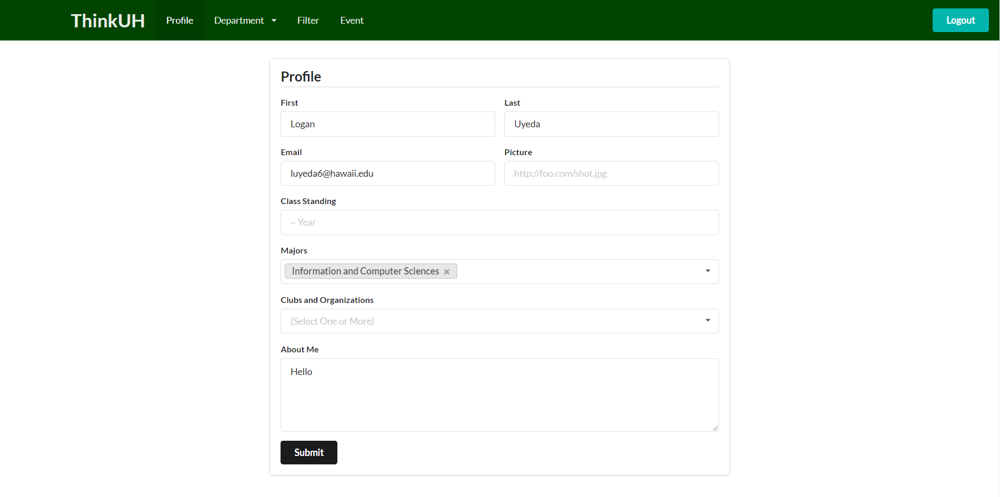

# Introducing: ThinkUH

### "a guide to the University of Hawai'i at Manoa community"

## The Problem

As a student on campus, wouldn't you like to know about the good and bad of each course? How about knowing what parts *really* gave people trouble? Or how about hearing voices from other students commenting on each course? Or how about hearing about the different clubs and events going on at campus?

## The Solution

[**ThinkUH**](https://thinkuh.meteorapp.com/) is a crowd-sourced information source for your academic courses and your community. Join and learn from fellow students about what your future is really like, and what is presently going on!

## Tentative Features

- Login/account system for personalized accounts

The below links have usernames in the url (johnson by default), please log in through the landing page first, then change 'johnson' to your own username.

- Course Guide
    - Comments on good/bad parts of course
    - "What You Need" / "What You'll Learn"
    - Forum attached to each course, with posts marked by semester and week
- "Blog" Posts
    - User-created
    - Tag keywords or courses
    - Commenting system
- Community
    - Clubs (persistent)
    - Events (e.g. events, job/internship posting or visits)
    - Commenting system

## Milestones

[Milestone 1](https://github.com/thinkuh/thinkuh/projects/1)

[Milestone 2](https://github.com/thinkuh/thinkuh/projects/2)
